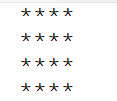

## Opdracht

Schrijf een python-script dat de een eenvoudig vierkant zoals in onderstaand voorbeeld maakt.

{:width="15%"}

## Uitvoer 

Omdat dit onze eerste code is, krijg je deze cadeau. Typ alles foutloos over. Hou rekening met de syntax die we geleerd hebben bij ‘2.1.1 Syntax’.

{:width="25%"}