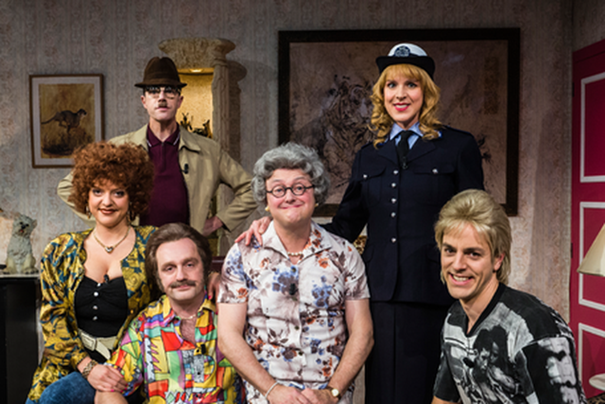

## Opdracht

De Familie Backeljau was een komisch Vlaams televisieprogramma. De familie was gebaseerd op een stereotiep marginaal gezin. Vrijwel alle personages in de reeks spraken plat Antwerps dialect.

Stel de  familie Backeljau voor met hun leeftijd. De leeftijd is een berekend veld op basis van hun geboortejaar (deze is fictief weliswaar) en het huidig jaar (2024).

{:width="50%"}


- Cois Backeljau - Vader - geboren in 1974
- Maria Steveniers - Vrouw van Cois - geboren in 1977
- Franky Backeljau - Zoon van Cois en Maria - geboren in 1998
- Sabrina Backeljau - Dochter van Cois en Maria - geboren in 2000
- Thérèse Backeljau - Bomma, moeder van Cois - geboren in 1950
- Marcel De Neudt - Buurman - geboren in 1984


Eerst stel je de familie voor. Je eindigt met de laatste zinnen.
{leeftijd} is een berekend veld. Het is niet de bedoeling om zelf de leeftijd te berekenen. Je programma doet dit.

*Uitvoer*
```
Dit is de familie backeljau.

De papa Cois is {leeftijd}
De mama Maria is {leeftijd}
De zoon Franky is {leeftijd}
De dochter Sabrina is {leeftijd}
De bomma Thérèse is {leeftijd}
De buurman Marcel is {leeftijd}


Mama Maria was {leeftijd} toen ze haar oudste zoon Franky kreeg.
Papa Cois was {leeftijd} toen hij papa werd van dochter Sabrina.
```


