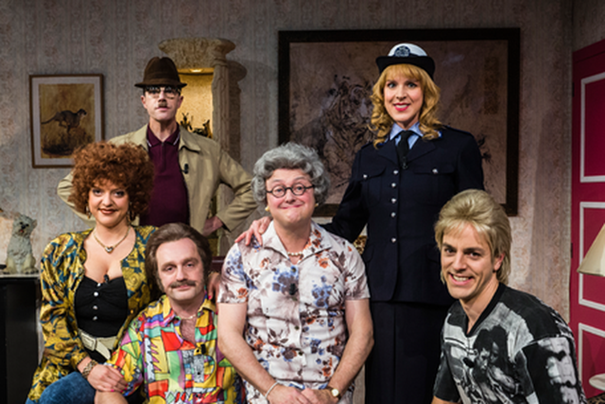

## Opdracht

De Verhulstjes is een Vlaamse realitysoap over het dagelijks leven van Gert Verhulst en zijn familie.

De familie bestaat uit Gert Verhulst (1968), zijn vrouw Ellen Callebout (1978) en zijn twee kinderen uit een vorig huwelijk Viktor (1994) en Marie (1995).

Stel de Verhulstjes voor met hun leeftijd zoals hieronder in het voorbeeld. {leeftijd} is een berekend veld op basis van hun geboortejaar en het huidig jaar (2024).

{:width="50%"}


*Uitvoer*
```
Dit zijn de Verhulstjes.

Gert Verhulst is {leeftijd}
Ellen Callebout is {leeftijd}
Viktor is {leeftijd}
Marie is {leeftijd}

Gert was {leeftijd} toen hij papa werd van Marie.
```


