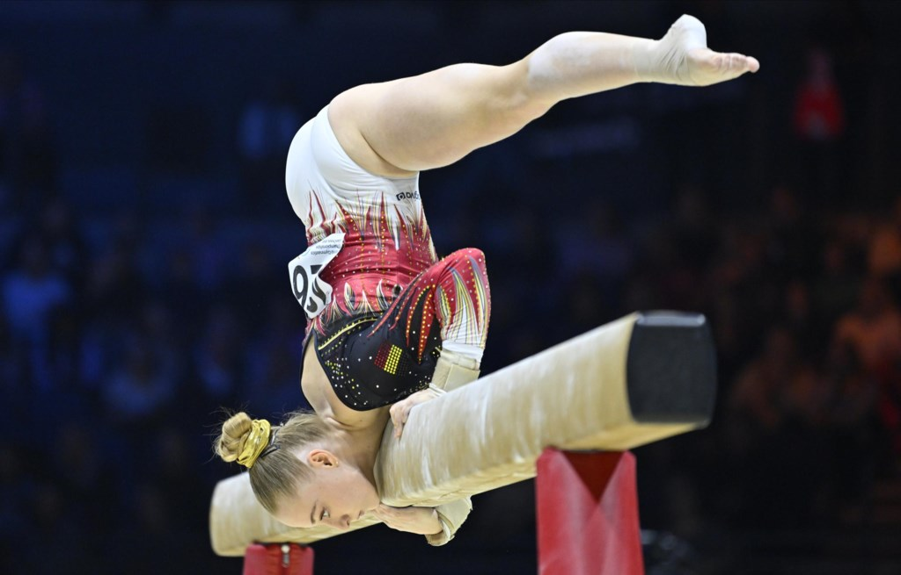

## Opdracht

Er was eens een getalenteerde Belgische turnster genaamd Lisa Vaelen, die deelnam aan de Olympische Spelen. Lisa, oud-leerling van deze school, was beroemd om haar indrukwekkende prestaties op de evenwichtsbalk. Op een dag, tijdens een trainingssessie, vroeg ze zich af wat de inhoud van de balk zou zijn waarop ze haar oefeningen uitvoerde.

{:width="25%"}

## Gevraagd
Schrijf een programma dat de inhoud van een balk berekent. Het programma vraagt de lengte, breedte en hoogte van de balk aan de gebruiker en berekent vervolgens de inhoud met de formule $$V = l \cdot b \cdot h$$. Het resultaat verschijnt zoals onderstaand voorbeeld op het scherm.


## Voorbeeld

*input*
```
Geef de lengte van de balk: 5
Geef de breedte van de balk: 10.6
Geef de hoogte van de balk: 20
```

*Output*
```
De inhoud van de balk is 1060.0 kubieke meters.
```


