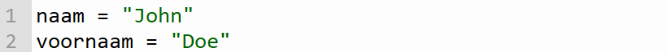

## Opdracht

Combineer de naam en achternaam en wijs het toe aan een nieuwe variabele met als naam `volledige_naam`.

Geef de gecombineerde naam weer in je output. Opgelet, namen plakken niet tegen elkaar. Daar zit een spatie tussen.

{:width="25%"}

